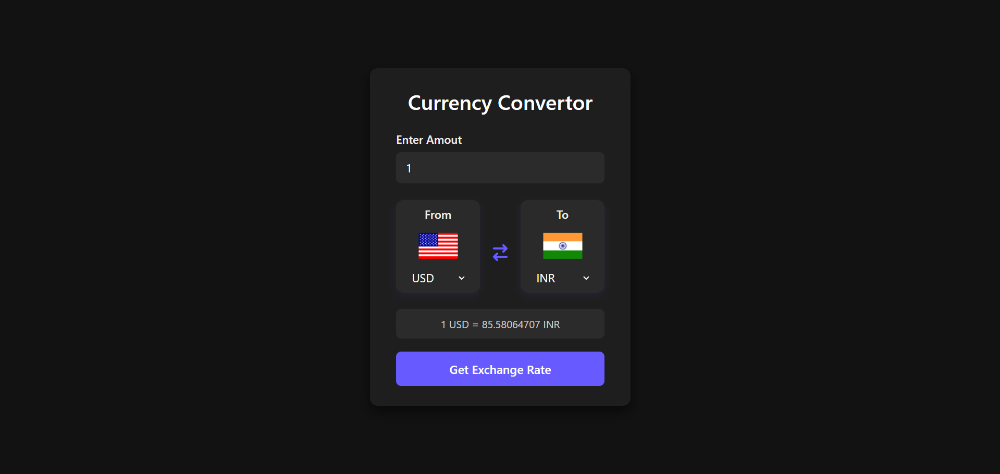
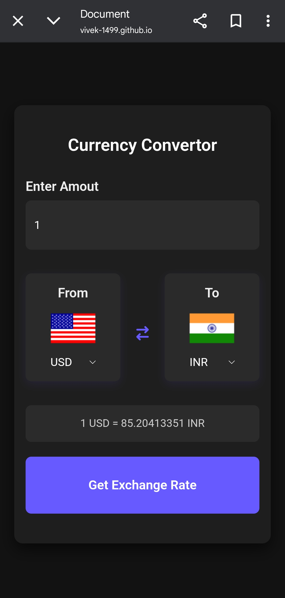

# 💱 Currency Converter Web App

A sleek and responsive currency converter web application that lets users convert values between different currencies in real-time using live exchange rates. Built using **HTML**, **CSS**, and **JavaScript**, with dynamic data fetched from the [Fawaz Ahmed Currency API](https://github.com/fawazahmed0/currency-api).

🔗 **Live Demo:** [CLick Here!!!](https://Vivek-1499.github.io/CurrencyConvertor)

---

## 📸 Screenshots

### 🖥️ Desktop View


### 📱 Mobile View


> ✨ A modern dark UI with smooth transitions, flag icons, and intuitive layout.

---

## 🚀 Features

- 🔄 Convert any amount between two currencies
- 🌍 Automatically loads all supported currencies
- 🇺🇸 Displays country flags based on selected currency
- ⚡ Fetches real-time exchange rates
- 🎨 Stylish dark-themed UI with hover animations
- 📱 Fully responsive design

---

## 🛠️ Tech Stack

- **HTML5**
- **CSS3**
- **Vanilla JavaScript**
- **Currency API** – [Fawaz Ahmed Currency API](https://github.com/fawazahmed0/currency-api)
- **Flag API** – [FlagsAPI.com](https://flagsapi.com)

## 🔧 Getting Started

You can use this project in two simple ways:  
Either run it locally or deploy it online.

---

### 💻 Run Locally

1. **Clone the repository:**
   ```bash
   git clone https://github.com/Vivek-1499/CurrencyConvertor.git
   ```

2. **Navigate to the project directory:**
   ```bash
   cd CurrencyConvertor
   ```

3. **Open `index.html` in your browser:**
   - You can simply double-click the `index.html` file.
   - Or use a Live Server extension (e.g., in VS Code) for automatic reloading.

---

### 🌐 Deploy Online Using GitHub Pages

1. **Push your project to a GitHub repository**  
   (If you haven't already)

2. **Go to your repository on GitHub**

3. **Navigate to:**
   `Settings` → `Pages`

4. **Under "Source"**, choose:
   - Branch: `main` (or your default branch)
   - Folder: `/ (root)`

5. **Click "Save"**

6. **GitHub Pages will generate a live URL for your site.**  
   Within a few seconds, your site will be accessible at:

   ```
   https://your-username.github.io/CurrencyConvertor
   ```

   Replace `your-username` with your actual GitHub username.

---

🎉 Your Currency Converter is now live and ready to share!
